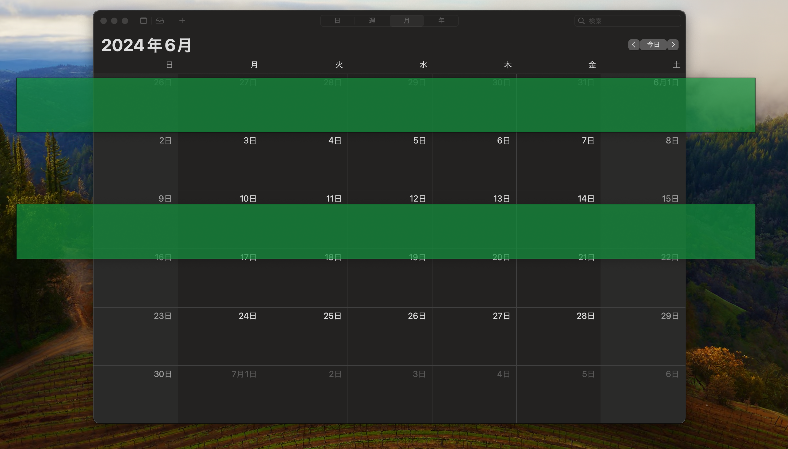

Slit against Dyslexia
=====================
This is a project to help people with dyslexia to read better. It is a Python GUI application that displays slit to help people with dyslexia to read better.

## How to run
1. Install Python 3.6 or later
2. Install the required packages by running `pip install -r requirements.txt`
3. Run the application by running `python app.py`

## How to use
1. Move Window
    - Click Left Mouse Button and drag
2. Change Slit Size
    - Click Right Mouse Button and drag

## License
This project is licensed under the MIT License - see the [LICENSE](LICENSE) file for details.

# Screenshots
